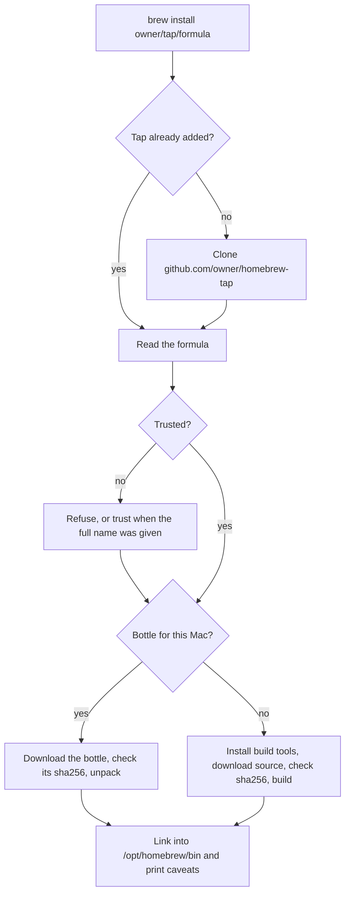
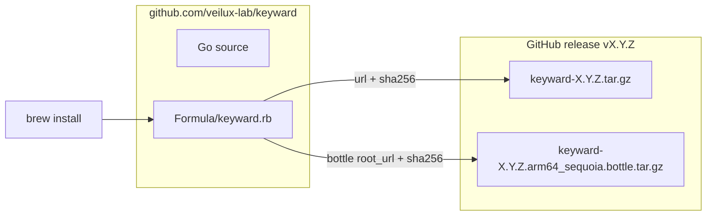
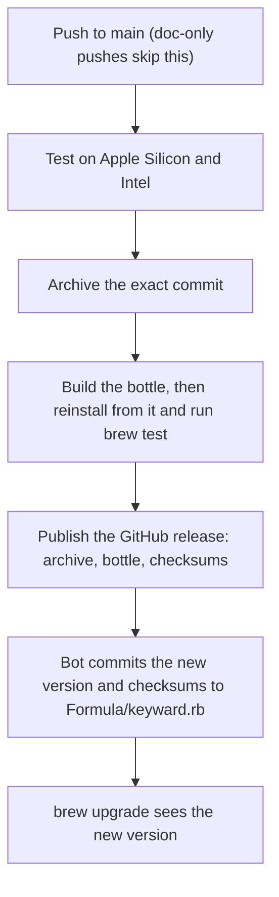
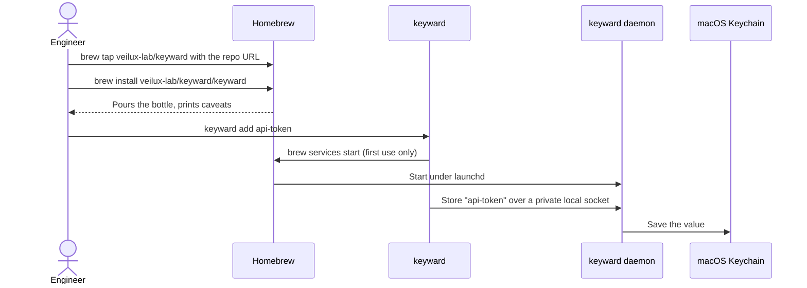

# Homebrew 101, and how Keyward uses it

## Homebrew in six words

| Term | What it is | Keyward's |
| --- | --- | --- |
| **Formula** | A Ruby recipe: where to download, how to build, how to test | [Formula/keyward.rb](../Formula/keyward.rb) |
| **Tap** | A Git repository of formulas that you add to Homebrew | This repository, `veilux-lab/keyward` |
| **Bottle** | A prebuilt, ready-to-unpack copy of an installed formula | One per release, for Apple Silicon |
| **Cellar** | Where installed versions live; `bin` links point into it | `/opt/homebrew/Cellar/keyward/<version>` |
| **Service** | A background job Homebrew registers with macOS `launchd` | The Keyward daemon |
| **Trust** | Homebrew 7's opt-in before it loads a third-party formula | Granted to the Keyward formula only |

## What `brew install` does

The formula pins a checksum for every download, so a tampered file fails the
install. Homebrew asks "proceed?" only when it must also install or upgrade other
packages.

## How Keyward is packaged

Three choices worth knowing:

- **One repository is both the code and the tap.** Homebrew assumes a tap called
  `homebrew-keyward`, so users add ours by URL first. Skipping that step gives
  "Repository not found".
- **Apple Silicon gets a bottle.** No Go and no compiler are needed, and the user's
  own Go is never upgraded. Intel Macs build it themselves; Homebrew no longer
  ships Go for Intel.
- **The daemon is a Homebrew service.** `keyward` starts it on first use through
  `brew services` and macOS starts it again at each login.

## How a release happens

Nobody edits the formula by hand. Every code push to `main` runs
[.github/workflows/release.yml](../.github/workflows/release.yml):

If any step fails, nothing is published and the formula keeps the old version.

## What a user runs

| Task | Command |
| --- | --- |
| Install | `brew tap veilux-lab/keyward https://github.com/veilux-lab/keyward.git` then `brew install veilux-lab/keyward/keyward` |
| Upgrade | `brew upgrade veilux-lab/keyward/keyward` then `keyward service install` |
| Pause access | `keyward service stop` (resume with `keyward service start`) |
| Remove everything | `keyward uninstall` (Keychain items are kept) |

Use `keyward service …` rather than the `brew services` lines Homebrew adds to
every service formula; Keyward's commands also keep first-use startup in step.

## Questions people ask

**Why the "tap is not trusted" warning?** Homebrew 7 refuses third-party formulas
until trusted. Installing by the full name `veilux-lab/keyward/keyward` trusts
only this formula. `brew uninstall` removes that trust, so a reinstall warns again.

**Why does an upgrade ask for Keychain access?** macOS ties Keychain access to the
exact program. Each release is a new program, so macOS may ask once.

**Does it send anything anywhere?** No. Keyward makes no network connections;
Homebrew itself downloads only the release files listed in the formula.

**Why doesn't `brew uninstall` remove everything?** Formulas get no uninstall
hook. `keyward uninstall` removes the daemon, local data, backups, the formula,
and the tap in one step.
